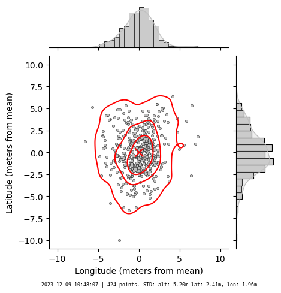
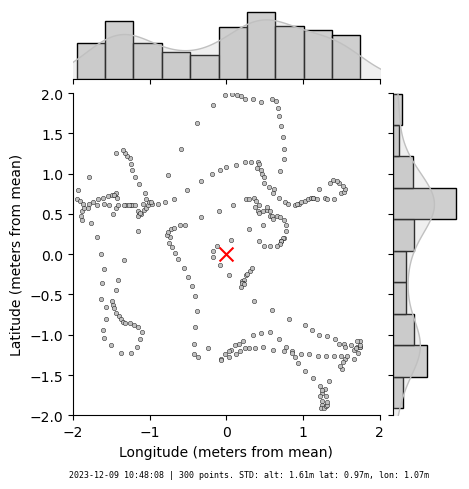
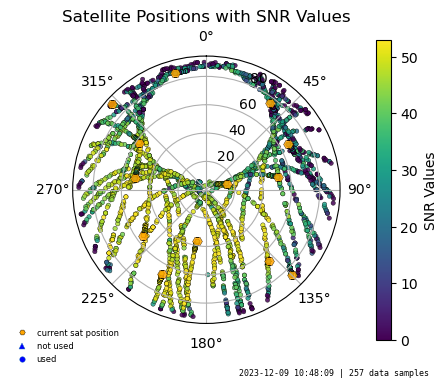
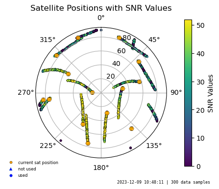

# GPS Data Visualization Script

Scripts to analyze GPS JSON data generated by `gpsd` and `gpspipe` and make plots of position changes and satellite visibility over time. This is a modern alternative for [`gpsprof`](https://github.com/andersson/gpsd/blob/master/gpsprof).

## Sample output


|                          |                              |
| :----------------------: | :--------------------------: |
|   `gpsjsonplot-pos.py`   |                              |
|     |     |
|  `gpsjsonplot-sats.py`   |                              |
|  |  |


## Prerequisites

- `gpsd` up and running; `gpspipe` or other source of json data
- Python 3.x with python packages: `json`, `matplotlib`, `numpy`, `seaborn`

## Usage

```bash
# get some samples from gpsd
gpspipe -v -w -n 10 > input.json

# make a plot of position changes using every 100th data point with contour lines
python gpsjsonplot-pos.py --json  input.json --outfile plot-lat-lon.png --every 100 --contour 4

# the same but for all data points and without contours lines
python gpsjsonplot-pos.py --json  input.json --outfile plot-lat-lon2.png --every 1 --contour 0

# plot satellites, every 10th data point
python gpsjsonplot-sats.py --json input.json --outfile plot-sattelites.png --every 10

# plot satellites, all points
python gpsjsonplot-sats.py --json input.json --outfile plot-sattelites2.png --every 1
```


-    `--json`: Path to the input JSON file containing GPS data.
-    `--outfile`: Path to the output image file where the plot will be saved.
-    `--every`: Optional parameter to select every n-th line from the input JSON file (default is 10).
-    `--contour`: Optional: number of contour lines. 0 - disables it.
